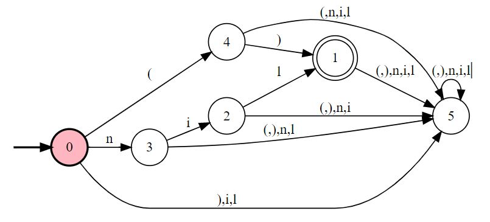
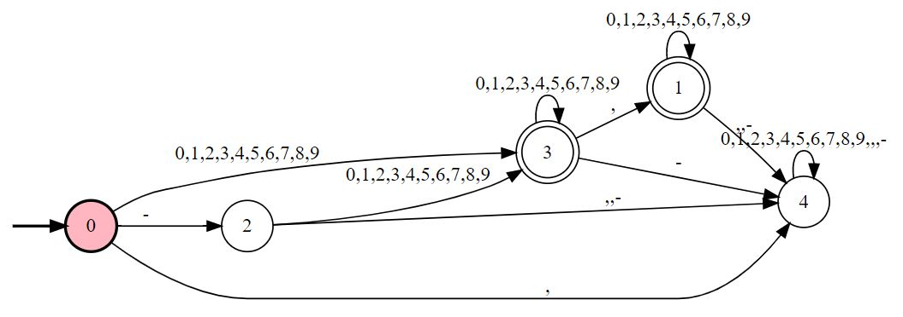
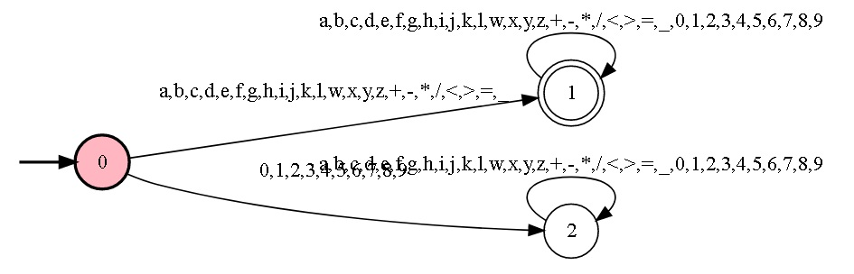

<!---
pre {
  -moz-tab-size: 4;
  tab-size: 4;
}
-->
## SimiLisp domain specific language

### Domain specific language similar to lisp

#### Lexical tokens (Scanner):
```
LETRA     = {a, b, c, d, e, f, g, h, i, j, k, l, m, n, o, p, q, r, s, t, u, v, w, x, y, z, 
            A, B, C, D, E, F, G, H, I, J, K, L, M, N, O, P, Q, R, S, T, U, V, W, X, Y, Z}

DIGITO    = {0, 1, 2, 3, 4, 5, 6, 7, 8, 9}

OPERADOR  = {+, -, *, /, <, >, =}

CENTINELA = {., (, ), _, ,}
```
<!---
NUMERO  -> ER: -?[0-9]*(,[0-9]*)?
(0+1+2+3+4+5+6+7+8+9)(0+1+2+3+4+5+6+7+8+9)*+((0+1+2+3+4+5+6+7+8+9)(0+1+2+3+4+5+6+7+8+9)*,(0+1+2+3+4+5+6+7+8+9)*)+(-(0+1+2+3+4+5+6+7+8+9)(0+1+2+3+4+5+6+7+8+9)*)+(-(0+1+2+3+4+5+6+7+8+9)(0+1+2+3+4+5+6+7+8+9)*,(0+1+2+3+4+5+6+7+8+9)*)

SIMBOLO -> ER: [a-zA-Z][\+\-\*\/\<\>\=\_][a-zA-Z]*[\+\-\*\/\<\>\=\_]*[0-9]*
((a+b+c+d+e+f+g+h+i+j+k+l+m+n+o+p+q+r+s+t+u+v+w+x+y+z+A+B+C+D+E+F+G+H+I+J+K+L+M+N+O+P+Q+R+S+T+U+V+W+X+Y+Z)+(\++\*+/+<+>+=+_))((a+b+c+d+e+f+g+h+i+j+k+l+m+n+o+p+q+r+s+t+u+v+w+x+y+z+A+B+C+D+E+F+G+H+I+J+K+L+M+N+O+P+Q+R+S+T+U+V+W+X+Y+Z)+(\++\*+/+<+>+=+_)+(0+1+2+3+4+5+6+7+8+9))*
((a+b+c+d+e+f+g+h+i+j+k+l+w+x+y+z)+(\++-+\*+/+<+>+=+_))((a+b+c+d+e+f+g+h+i+j+k+l+w+x+y+z)+(\++-+\*+/+<+>+=+_)+(0+1+2+3+4+5+6+7+8+9))*
(a+b+c+d+e+f+g+h+i+j+k+l+w+x+y+z+\++-+\*+/+<+>+=+_)(a+b+c+d+e+f+g+h+i+j+k+l+w+x+y+z+\++-+\*+/+<+>+=+_+0+1+2+3+4+5+6+7+8+9)*
(\++-+\*+/+<+>+=+_)
(a+b+c+d+e+f+g+h+i+j+k+l+m+n+o+p+q+r+s+t+u+v+w+x+y+z+A+B+C+D+E+F+G+H+I+J+K+L+M+N+O+P+Q+R+S+T+U+V+W+X+Y+Z)
-->

#### Syntactic tokens (Parser):
```
VACIO   -> ER: '()' + 'nil'
```
<!---->


```
NUMERO  -> ER: DIGITO* (',' DIGITO DIGITO*) + ('-' DIGITO) DIGITO* (',' DIGITO DIGITO*)
```
<!---->


```
SIMBOLO -> ER: ('_' + LETRA) ('_' + '-' + LETRA + NUMERO)*
```
<!---->


```
ATOMO, LISTA, EXPRESION
```

#### BNF Notation

```bnf

LISTA     ::= ( _LISTA )
            | VACIO
          
_LISTA    ::= EXPRESION
            | EXPRESION . _LISTA

EXPRESION ::= ATOMO
            | LISTA

ATOMO     ::= SIMBOLO
            | OPERADOR
            | NUMERO
            | VACIO
          
SIMBOLO   ::= _
            | LETRA
            | _ _SIMBOLO
            | LETRA _SIMBOLO
            
_SIMBOLO  ::= _
            | -
            | LETRA
            | DIGITO
            | _ _SIMBOLO
            | - _SIMBOLO
            | LETRA _SIMBOLO
            | DIGITO _SIMBOLO
     
VACIO     ::= () | nil

LETRA     ::= a | b | c | d | e | f | g | h | i | j | k | l | m 
            | n | o | p | q | r | s | t | u | v | w | x | y | z
            | A | B | C | D | E | F | G | H | I | J | K | L | M 
            | N | O | P | Q | R | S | T | U | V | W | X | Y | Z
            
OPERADOR  ::= + | - | * | / | < | > | =
            
DIGITO    ::= 0 | 1 | 2 | 3 | 4 | 5 | 6 | 7 | 8 | 9

NUMERO    ::= _NUMERO
            | , _NUMERO
            | ( - _NUMERO )
          
_NUMERO   ::= DIGITO
            | _NUMERO DIGITO
            | , __NUMERO

__NUMERO  ::= DIGITO
            | __NUMERO DIGITO

```

#### Syntax example:

```common-lisp
> (+ . 1 . 2)
> 3

> (+ . (-1) . 2)
> 1

> (quote . (+ . 1 . 2))
> (+ . 1 . 2)

> (eval . (quote . (+ . 1 . 2)))
> 3

> (quote . hola)
> hola

> (quote . (a . b . +))
> (a . b . +)

> (defun . doble . (x) . (+ . x . x))

> (doble . 5)
> 10

> (defun . true . (a . b) . a)
> (defun . false . (a . b) . b)         
> (defun . if . (p . a . b) . (p . a . b))

> (if . true . 4 . 9)
> 4          

> (defun . and . (p . q) . (if . p . q . false))
> (defun . or . (p . q) . (if . p . true . q))

> (if . (and . (true . false)) . 4 . 9)
> 9     
```

  
